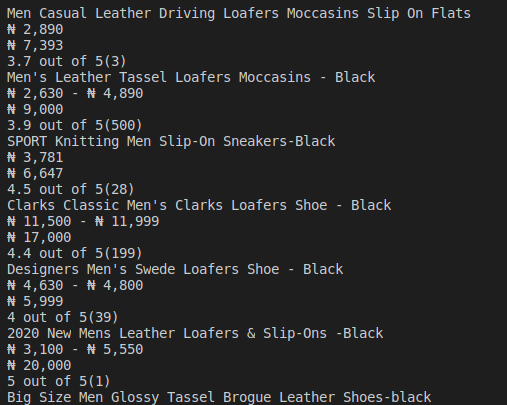

<h2 align="center">Jumia Men's Loafers and slip-ons Store Scraper</h2>

This project is a scrape of a store in one of the biggest e-commerce stores in Nigeria, Jumia. The data this project scrape are the names, the prices, discount prices, and the ratings for the products.



### [Link to the scrapped website](https://www.jumia.com.ng/mens-loafers-slip-ons/)

## 🔧 Built with<a name = "built_using"></a>

- [Ruby](https://www.ruby-lang.org/)

### 🛠 Cloning & Installation <a name = "installing"></a>

Clone and run this repository by running these commands on the terminal:

```
- git clone https://github.com/Godswilly/Web-Scraper.git;
- cd Web-Scraper
- `gem install bundler`
- `bundle install`
- run ruby bin/main.rb
- run `rspec` to run the test in the terminal
```


## ✒️ Author <a name = "author"></a>

👤 **Kalu Agu Kalu**

- Github: [@Godswilly](https://github.com/Godswilly)
- Twitter: [@KaluAguKalu17](https://twitter.com/KaluAguKalu17)
- LinkedIn: [Kalu Agu Kalu](https://www.linkedin.com/in/kalu-agu-kalu/)

## 🤝 Contributing

Contributions, issues, and feature requests are welcome!

Feel free to check the [issues page](https://github.com/Godswilly/Web-Scraper/issues).

## 👍 Show your support

Give and ⭐️ if you like this project!

## 📝 Acknowledgements

- Microverse and The Odin Project
- Jumia E-commerce Store

## 📝 License

This project is free to use as learning purposes. For any external content (e.g. logo, images, ...), please contact the proper author and check their license of use.
